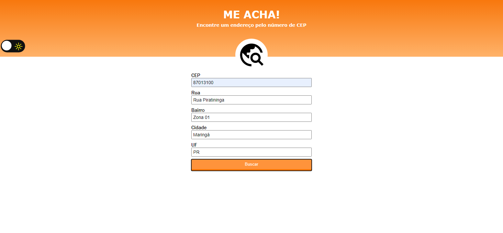

<table align="right">
  <tr>
    <td>
      <a href="readme-en.md">🇺🇸 English</a>
    </td>
  </tr>
  <tr>
    <td>
      <a href="README.md">🇧🇷 Português</a>
    </td>
  </tr>
</table>

# Me Acha Cep :mag_right:
| Link do Projeto { <a href= "https://andrecampelor.github.io/Me-Acha/"> Me Acha Cep </a>} |

## Sobre  :memo:
O projeto consiste em um sistema que retorna os dados (Rua, Bairro, Cidade e Estado) do CEP inserido,

utilizando a API <a href= "https://viacep.com.br"> ViaCep </a>

### Layout :computer:

### **Dark mode** :new_moon:   

### Tecnologias utilizadas :rocket:
- HTML
- CSS
- JS

### Autor  :man_technologist:

André Luiz Campelo

 
