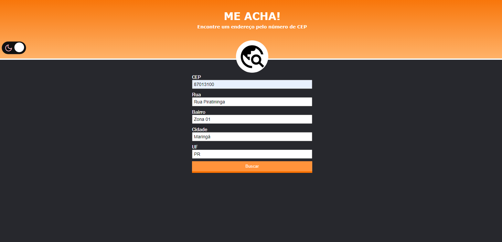

# Me Acha Cep

https://andrecampelor.github.io/Me-Acha/

## Sobre
Sistema que retorna os dados (Rua, Bairro, Cidade e Estado) do CEP inserido.  

### Layout

### **Dark mode**  

### Tecnologias utilizadas
- HTML
- CSS
- JS

### Autor

André Luiz Campelo

https://www.linkedin.com/in/andr%C3%A9-luiz-campelo-710701209/
