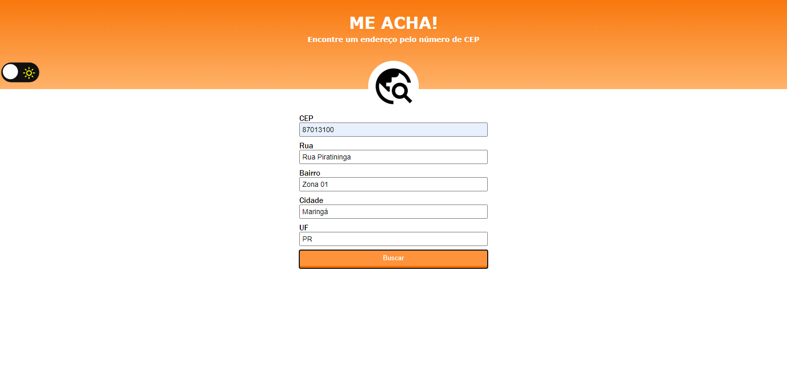
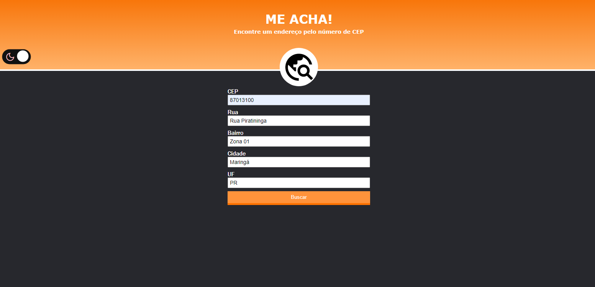

<table align="right">
  <tr>
    <td>
      <a href="readme-en.md">🇺🇸 English</a>
    </td>
  </tr>
  <tr>
    <td>
      <a href="README.md">🇧🇷 Português</a>
    </td>
  </tr>
</table>

# Find Me Cep :mag_right:
| Project Link { <a href= "https://andrecampelor.github.io/Me-Acha/"> Find Me Cep </a>} |

## About  :memo:
The project consists of a system that returns data (Street, Neighbourhood, City e State) of the inserted CEP (Brazilian Zipcode),

using the API <a href= "https://viacep.com.br"> ViaCep </a>

### Layout :computer:

### **Dark mode** :new_moon:   

### Tecnologias utilizadas :rocket:
- HTML
- CSS
- JS

### Autor  :man_technologist:

André Luiz Campelo

 